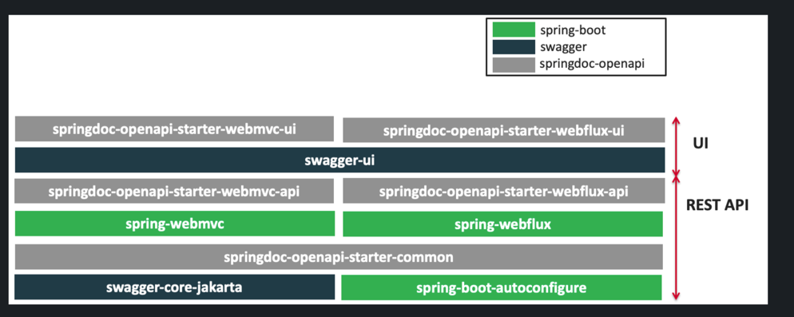
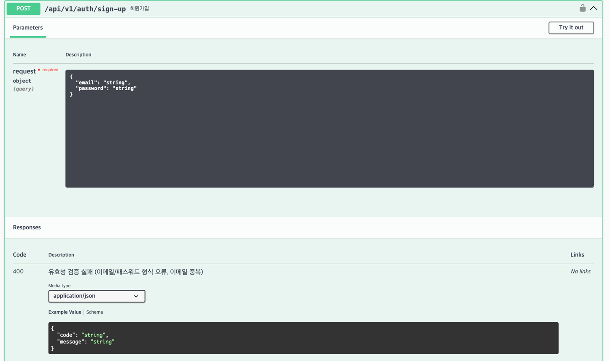
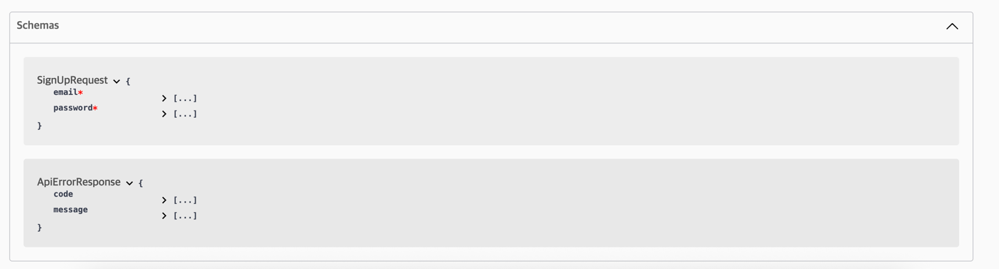
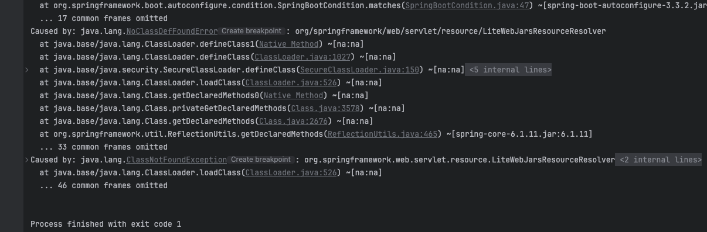
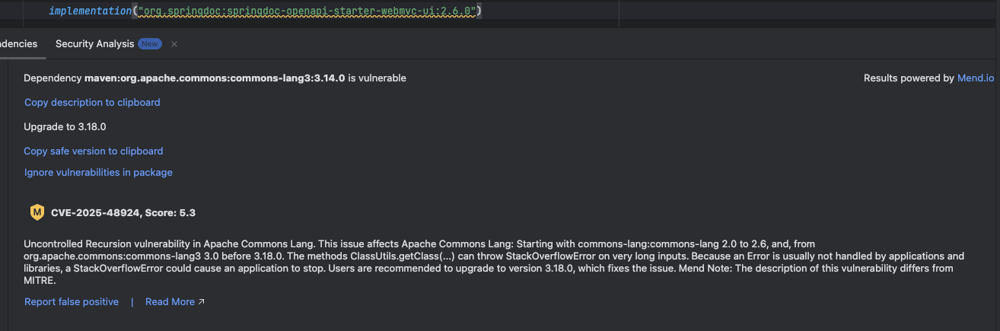

## OpenAPI 적용 및 springdocs-openapi를 사용한 자동 생성
### OpenAPI
- REST API 를 기술하기 위한 표준 명세 (JSON/YAML)
- 이전에는 "Swagger" 라고 불렀으나, 현재는 규격을 OpenAPI 라 하며 도구 모음을 Swagger로 구분 (Swagger UI, Swagger Editor, ...)


- OpenAPI 3 기본 구조
```
openapi: 3.0.4
info:
  title: Sample API
  description: Optional multiline or single-line description in [CommonMark](http://commonmark.org/help/) or HTML.
  version: 0.1.9

servers:
  - url: http://api.example.com/v1
    description: Optional server description, e.g. Main (production) server
  - url: http://staging-api.example.com
    description: Optional server description, e.g. Internal staging server for testing

paths:
  /users:
    get:
      summary: Returns a list of users.
      description: Optional extended description in CommonMark or HTML.
      responses:
        "200": # status code
          description: A JSON array of user names
          content:
            application/json:
              schema:
                type: array
                items:
                  type: string
```
---

### springdoc-openapi
- Spring Boot 내부 핸들러(Controller)를 OpenAPI 스펙으로 생성 해주는 오픈소스 라이브러리
- 표준 명세는 /v3/api-docs URL 을 통해 확인 가능
- Swagger-UI 를 통해 기본적인 시각화 및 테스트 가능
- OpenAPI 3, Spring Boot, JSR-303 (@NotNull, @Min, @Max), Swagger-UI 를 지원
- springdocs-openapi 구조
    

- 구조 개념
```
            Spring Controller
      (예: @RestController, @PostMapping)
                    │
                    ▼
            springdoc-openapi
        (코드를 OpenAPI YAML로 자동 생성)
                    │
                    ▼
        OpenAPI 스펙 (YAML/JSON)
       /v3/api-docs, /v3/api-docs.yaml
                    │
                    ▼
                Swagger UI
      /swagger-ui/index.html 에서 시각화
```

---

### springdoc-openapi 적용

**build.gradle.kts**
```
// 2.8.0+ 은 Spirng Boot 3.4.x 이상 지원
implementation("org.springdoc:springdoc-openapi-starter-webmvc-ui:2.6.0")
```
**application.yml**
```
springdoc:
   api-docs:
     path: /api-docs
   swagger-ui:
     path: /swagger-ui.html
     enabled: true
```
**AuthController**
```
@Tag(name = "Auth", description = "로그인/회원가입 관련 API")
@RestController
@RequestMapping("/api/v1/auth")
public class AuthController {
    
    ...
    
    @Operation(summary = "회원가입")
    @ApiResponses(value = {
        @ApiResponse(
            responseCode = "400",
            description = "유효성 검증 실패 (이메일/패스워드 형식 오류, 이메일 중복)",
            content = @Content(
                mediaType = "application/json",
                schema = @Schema(implementation = ApiErrorResponse.class)
            )
        )
    })
    @PostMapping("/sign-up")
    public ResponseEntity<SignUpResponse> signUp(@Valid SignUpRequest request) {
        ...
    }
    ...

}
```
**Swagger-UI**



---

### 트러블 슈팅
- 버전 미스매치로 부팅 오류
  - Spring Boot 3.3.x ↔ springdoc 2.8.x 조합에서 LiteWebJarsResourceResolver 관련 NoClassDefFoundError 발생
  
  - **해결: springdoc 버전을 2.6.0 으로 낮춰 적용**
- 전이 의존성 취약점(CVE) 경고
  - springdoc 2.6.0 버전 내의 commons-lang3:3.14.0 버전의 취약점 경고 (CVE-2025-48924)
  - CVE 취약점 개요는 ClassUtils.getClass(...) 에서 입력값이 매우 길 경우 재귀가 과도하게 발생하여 StackOverFlowError 위험이 있음
  
  - **해결: commons-lang3:3.18.0 버전으로 업그레이드**

---

### 참고 자료
- [Swagger IO Open API 3.0 Specification](https://swagger.io/docs/specification/v3_0/about/)
- [spirngdocs-openapi 공식문서](https://springdoc.org/)
